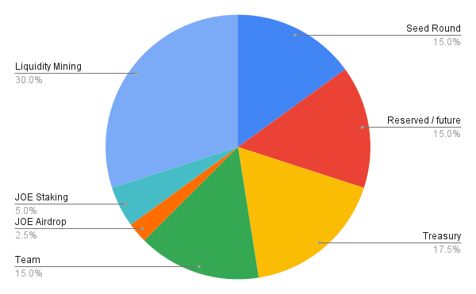
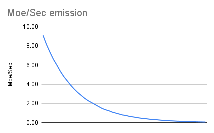

# [Moe-Core](https://github.com/traderjoe-xyz/moe-core)

This repository contains the contracts, tests and deploy scripts for the Moe protocol.

## Contracts

### [Moe](./src/Moe.sol)

The `Moe` contract is the governance token of the protocol. It is a standard ERC20 token where only the `minter` can mint tokens up to the maximum supply, which is set at 500M MOE.
The distribution of the tokens is as follows:

- 45% to vesting contracts with a 1 year cliff and 3 year vesting (total 4 years)
  - 15% to seed investors.
  - 15% to future investors.
  - 15% to the team.
- 2.5% to Joe stakers as an airdrop, distributed at the start of the protocol.
- 5% to Joe stakers, distributed over 1 year.
- 30% to liquidity mining incentives, distributed over 4 years.
- 17.5% to the treasury, distributed over 4 years.



The emission rate will be deflationary, starting at 9.1 MOE per second and decreasing by ~10% every month for 4 years.



### [MasterChef](./src/MasterChef.sol)

The `MasterChef` contract is the only contract that can mint MOE tokens. It will be used to distribute the liquidity mining rewards to the farms.
Users can stake their LP tokens to earn MOE rewards. The rewards are distributed based on the votes in the VeMoe contract.
Admins can open farms, update the MOE per second and add extra rewarders to the farms. They can also update the treasury address.

### [MasterChefRewarder](./src/rewarders/MasterChefRewarder.sol)

The `MasterChefRewarder` contract is the rewarder that will be used on top of the `MasterChef` contract to distribute extra rewards to the farms.
Only the `MasterChef` contract can call `onModify` to update the user's rewards.
Admins can set the start, end and extra reward per second. The adminds can also sweep any non active reward tokens.

### [MoeStaking](./src/MoeStaking.sol)

The `MoeStaking` contract is the staking contract for the MOE token. Users can stake their MOE tokens to receive `veMOE` tokens and rewards from `sMoe`.

### [StableMoe](./src/StableMoe.sol)

The `StableMoe` contract will distribute the protocol fees from the dex to the MOE stakers. They are firstly converted to a single reward token (most liely a stablecoin) and then distributed to the stakers. Users can call `claim` to get their rewards.
Admins can add/remove rewards (each token can be added only once, removal is permanent) and sweep any non active reward tokens.

### [VeMoe](./src/VeMoe.sol)

The `VeMoe` contract is the vesting escrow contract for the `veMOE` tokens. The `veMOE` tokens are non-transferable and can be used to vote on pools to increase their weight. If user wants to unstake from `MoeStaking`, they need to have 0 votes on pools and will loose their entire `veMOE` balance.
The weight will be used to calculate the share of the MOE rewards going to that pool in the `MasterChef`. To avoid gas issues, only pools that are in the top pools list will receive rewards. This list will be updated every week or so.
Anyone can create a bribe pool to incentivize people to vote on a pool. After having voted, users can select to which bribes they want to receive rewards from (only one per pool id).
Admins can set the top pools ids and the veMOE per second per MOE ratio.

### [VeMoeRewarder](./src/rewarders/VeMoeRewarder.sol)

The `VeMoeRewarder` contract is the rewarder that should be used for bribes pool to distribute rewards to voters of a pool. Only the `VeMoe` contract can call `onModify` to update the user's rewards.

### [BaseRewarder](./src/rewarders/BaseRewarder.sol")

The `BaseRewarder` contract is the base contract for the rewarders. It is used by the `VeMoeRewarder` and `MasterChefRewarder` contracts.

### [Dex](./src/dex)

The dex contracts are a fork of [Uniswap v2](https://github.com/Uniswap/v2-core) with some modifications:

- bump solidity version from 0.5.16 to 0.8.20
- pairs are deployed as immutable clones instead of redeploying the entire pair. This will greatly reduce the gas cost of creating pairs.
- instead of minting protocol fees as LP tokens, they are directly sent to the feeTo address. This will reduce the gas cost of SMoe conversion and increase the rewards by summing the fees from all pairs.

## Order of operations

1. Fill and verify the [parameters](./script/parameters.json).
2. Deploy the Moe protocol contracts using the [protocol script](./script/0_DeployProtocol.s.sol).
3. Deploy the dex contracts using the [dex script](./script/1_DeployDex.sol).
4. Create default pools and farms.
5. Set the `veMoePerSecPerMoe` on the `VeMoe` contract to start the veMOE distribution.
6. Once there is some votes on the top pools, set the `moePerSec` on the `MasterChef` contract to start the MOE distribution.

## Foundry

This repository uses Foundry. The documentation can be found [here](https://book.getfoundry.sh/).

### Build

To build the contracts, run:

```shell
$ forge build
```

### Test

To run the tests, run:

```shell
$ forge test
```

### Deploy

To deploy the contract, copy the `.env.example` to `.env` and fill in the values. Then run:

```shell
$ forge script script/<name_of_the_script> --broadcast --verify
```
